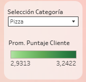
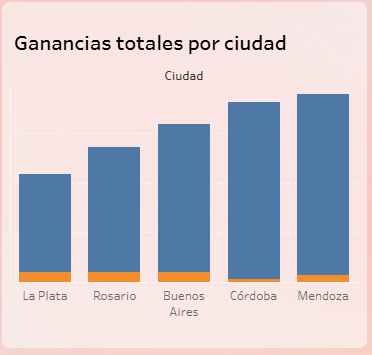
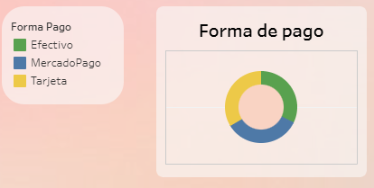
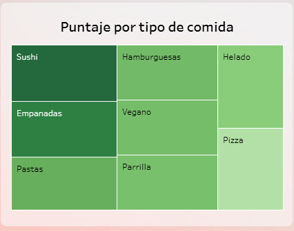

# tableau-pedidosya-dashboard
Análisis visual de ventas, métodos de pago y preferencias por ciudad en PedidosYa Argentina. Incluye KPIs, mapas y navegación entre dashboards. Hecho en Tableau para fines académicos y de portafolio.
# 📊 Dashboard de PedidosYa Argentina

Este repositorio contiene screenshots y una breve descripción del dashboard interactivo desarrollado en Tableau Public. El análisis se basa en datos de PedidosYa Argentina y busca visualizar insights clave sobre ventas, preferencias y comportamiento de los usuarios en diferentes ciudades.

🔗 **Dashboard online**:  
[Ver en Tableau Public](https://public.tableau.com/app/profile/morena.figueroa/viz/Entregafinal_17545157966430/Dashboard_Principal)

---

## 📌 Secciones del Dashboard

### 1. KPIs principales  
Resumen de métricas clave como cantidad total de pedidos, ganancias, puntajes promedio, etc.

---

### 2. Filtros interactivos  
Permiten al usuario segmentar la información por ciudad, tipo de comida y forma de entrega.

---

### 3. Ganancias totales por ciudad  
Gráfico de barras que muestra el total de ganancias agrupado por ciudad.

---

### 4. Preferencias de forma de pago  
Visualización de las formas de pago más utilizadas.

---

### 5. Puntaje promedio por tipo de comida  
Gráfico de burbujas o barras según el puntaje promedio otorgado por los usuarios a distintos tipos de comida.

---

### 6. Navegación a dashboard detallado

#### Botones de navegación  
  

Este botón permite acceder a un segundo dashboard con información más específica:

#### a. Pedidos por ciudad y método de entrega  
Gráfico combinado que permite ver patrones entre regiones y tipos de envío.  

#### b. Pedidos por zona geográfica  
Mapa que geolocaliza la distribución de pedidos a nivel país.  

---

## 🛠️ Herramientas utilizadas

- Tableau Public
- Dataset de PedidosYa Argentina
- GitHub (para documentación y portafolio)

---

## 📬 Contacto

Morena Figueroa  
📧 morenafigueroa.a@gmail.com  
🔗 [LinkedIn](https://www.linkedin.com/in/weneedmoretranslations/)  
🌐 [GitHub](https://github.com/MoreAnalysis)

---

