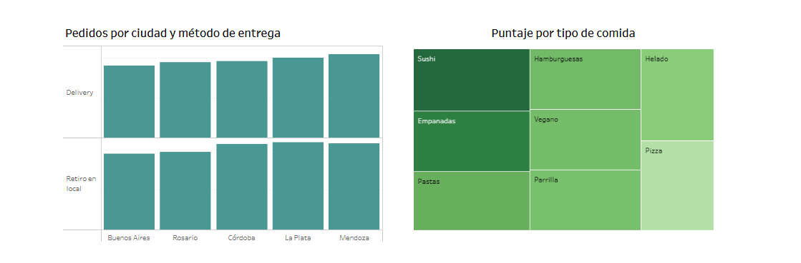
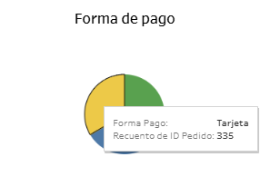
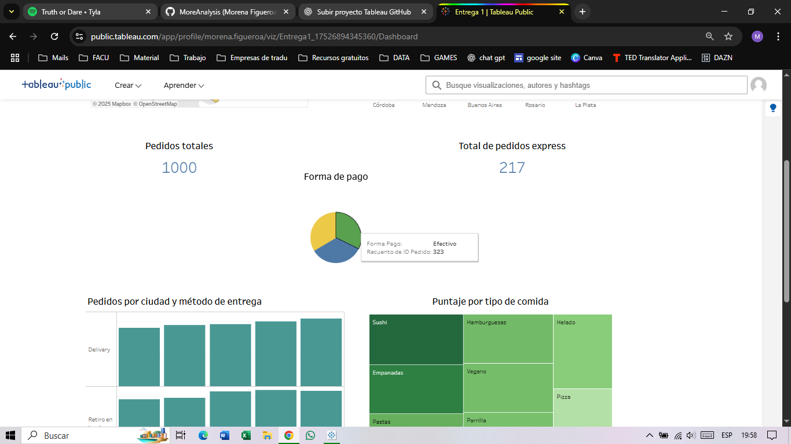
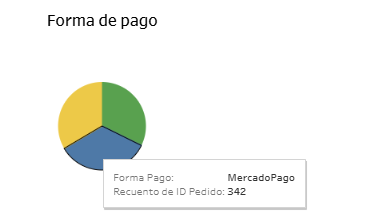

# tableau-pedidosya-dashboard
# PedidosYa Dashboard en Tableau

Este proyecto muestra un tablero interactivo creado en **Tableau** con datos de la plataforma **PedidosYa Argentina**. El objetivo es visualizar de manera clara y eficiente el comportamiento de los pedidos, incluyendo métricas clave como:

- Pedidos por zona geográfica
- Ganancias por zona según categoría de comida
- Pedidos totales
- Pedidos express
- Formas de pago
- Pedidos por ciudad y método de entrega
- Puntaje por tipo de comida

## 📊 Capturas del Dashboard

A continuación, se muestran algunas vistas del dashboard construido:

### Gráficos #1

### Gráficos #2

### Gráfico 3

### Gráfico 4

### Gráfico 5

---

## 📁 Archivos

- `PedidosYa_Tableau.twbx`: archivo del dashboard interactivo en Tableau.
- `Graficos1.png` a `Grafico5.png`: capturas de distintas secciones del tablero.

---

## ✅ Requisitos

Para abrir el archivo `.twbx`, necesitás tener instalado [Tableau Desktop](https://www.tableau.com/).

---

## 🧠 Comentarios

Este análisis puede servir como punto de partida para la toma de decisiones basadas en datos para servicios de delivery, logística o comercios asociados a plataformas de entrega.

