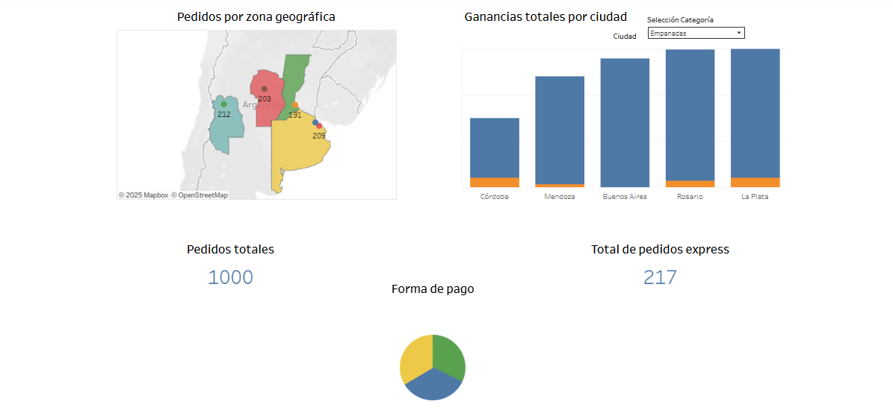
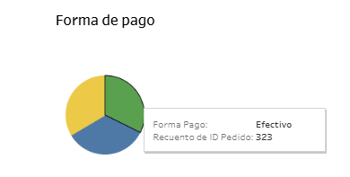

# PedidosYa Dashboard in Tableau

This project showcases an interactive **Tableau dashboard** built using real delivery data from **PedidosYa Argentina**. The goal is to clearly and efficiently visualize key business insights, including:

- Orders by Geographic Area
- Total Revenue by City and Food Category 
- Total Orders
- Total Express Orders 
- Payment Method
- Orders by City and Delivery Method
- Rating by Food Type

## 📊 Dashboard Snapshots

Below are several screenshots of the dashboard views:

### Charts 1

*The map visualization displays the volume of orders segmented by geographic zones. It helps identify which regions receive the highest number of orders and detect potential areas of opportunity.*
*A stacked bar chart showing total revenue per city, broken down by food category. This allows for a quick comparison between locations and highlights which categories drive the most income in each city.*
*First KPI (left) displays the total number of orders received during the selected period. It serves as a quick reference for overall business performance.*
*Second KPI (right) is a metric showing the number of express orders, which are defined as orders delivered in less than 30 minutes. This insight helps analyze demand for fast deliveries and operational efficiency.*

### Charts 2

*This grouped bar chart breaks down the number of orders by delivery method (e.g., home delivery, pickup) across different cities. Useful for logistics and operational planning.*
*A heat map displaying customer satisfaction scores across different food categories. This visualization helps identify which types of food perform best in terms of quality and user experience.*

### Payment Method (specified)

*A pie chart showing the distribution of payment methods used by customers (e.g., card, cash, online platforms). It offers insight into customer preferences and payment trends.*

### Payment Method #2 (specified)

### Payment Method #3 (specified)

---

## 📁 Files Included

- `PedidosYa_Tableau.twbx`: Packaged Tableau dashboard file (includes data and visualizations).
- `Charts1.png` to `Chart5.png`: Images showing different sections of the dashboard.

---

## 💻 Requirements

To open the `.twbx` file, you need to have [Tableau Desktop](https://www.tableau.com/) installed.  
Alternatively, you can view the dashboard online through my [Tableau Public profile](https://public.tableau.com/app/profile/morena.figueroa/vizzes).

---

## 💡 Notes

This dashboard can serve as a starting point for data-driven decision making in delivery services, logistics, or local businesses using on-demand platforms.

---

## 💬 Contact

📧 morenafigueroa.a@gmail.com  
🔗 [LinkedIn](https://www.linkedin.com/in/weneedmoretranslations/)

This project was created for educational purposes as part of my data analysis portfolio.
